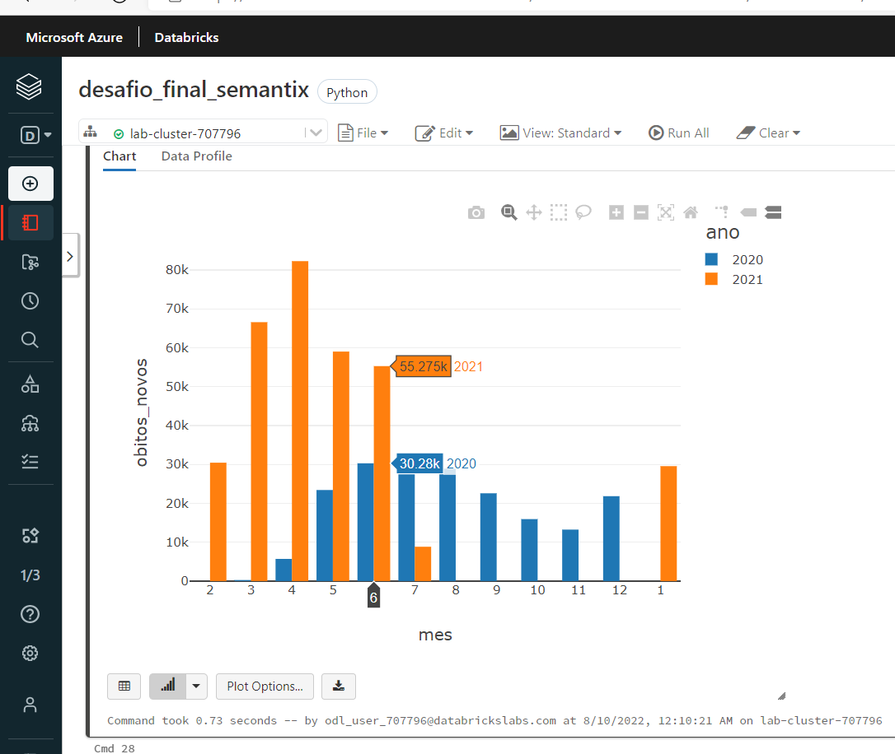
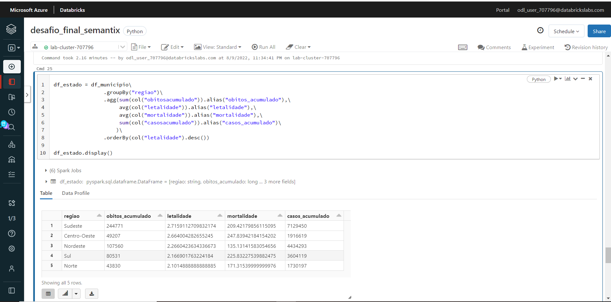

<h1> Projeto final </h1>
<h2>Bootcamp de engenheiro de Bigdata </h2> 
<h3> Semantix </h3>
  - utilizado vm em ubuntu
  - e utilizando docker
  - docker compose alterado : docker-compose -f docker-compose-minimo.yml up (*não fiz download dos env)
  
  
  Testei usando databricks também para saber se a performance é a mesma, para processamento de consulta, foi mais rápido usuando 140 gb com 20 cores do que 14 e 4 coures, porém quando falamos em disco , como gravar no hdfs e particionar por municípo, o tempo das duas configurações foi quase o mesmo, só em processos que precisa de mais memoria
  
   

source : https://mobileapps.saude.gov.br/esus-vepi/files/unAFkcaNDeXajurGB7LChj8SgQYS2ptm/04bd3419b22b9cc5c6efac2c6528100d_HIST_PAINEL_COVIDBR_06jul2021.rar

1- copiar para dentro do docker

      #criar diretorio temp no container

      docker exec -it namenode mkdir /temp

      #criar diretorio temp no container

      docker exec -it namenode mkdir /temp/excel

      #copiar arquivos para diretorio dentro do container

      docker cp /home/ubuntu/Downloads/excel namenode:/temp

      #colocar dentro do hdfs

      docker exec -it namenode hdfs dfs -put /temp/excel  /user/jairomonassa/covid

      #verificar se os arquivos estao la

      docker exec -it namenode hdfs dfs -ls /user/jairomonassa/covid/excel

      #remover a pasta temporaria do container

      docker exec -it namenode rm -R /temp/excel
      
  2 - criar tabela do hive usando beeline
  
      docker cp /home/ubuntu/treinamentos/spark/covid.hsql hive-server:/opt
      
      docker exec -it hive-server beeline -u jdbc:hive2:// -n hive -p hive -f covid.hsql >> out.txt
      
      rodar a query covid.hsql
      
  3 - rodar o jobs para gravar no hive 
  
    * foi criado um notebook só para exploração e teste, mas será rodado pelo job
    
    ** curl -O https://repo1.maven.org/maven2/com/twitter/parquet-hadoop-bundle/1.6.0/parquet-hadoop-bundle-1.6.0.jar
    
    *** docker cp parquet-hadoop-bundle-1.6.0.jar jupyter-spark:/opt/spark/jars
    
    docker cp covid_excel.py jupyter-spark://bin
    
    docker exec -it jupyter-spark spark-submit --master yarn --deploy-mode client --queue root.bi.carga --executor-memory 12g --executor-cores 8 --total-executor-cores 8 /bin/covid_excel.py
    #ultimos dados do brasil
    df_brazil = df_covid.where(col("regiao")=='Brasil')\
               .orderBy(col("data").desc())\
               .limit(1)
               
    # pegar o ultimos recuperados e em acompanhamento
    df1 = df_brazil\
                 .select(col('recuperadosnovos'),col('emacompanhamentonovos'))\
                 .limit(1) 
    #df1.show()
    df1.write.mode("overwrite").parquet("/user/jairomonassa/v1")
    
    df2 = df_brazil\
               .select(col('casosnovos'),col('casosacumulado'))\
               .limit(1)
    #df2.show()  
    df2.write.mode("overwrite").parquet("/user/jairomonassa/v2")
    
    df3 = df_brazil\
                 .withColumn("letalidade",col("obitosacumulado")/col('casosacumulado')*100)\
                 .withColumn("letalidade",round(col("letalidade"),2))\
                 .withColumn("mortalidade",col("obitosacumulado")/col('populacaotcu2019')*100000)\
                 .withColumn("mortalidade",round(col("mortalidade"),2))\
                 .select(col('obitosacumulado'),col('obitosnovos'),col("letalidade"),col("mortalidade"))\
                 .limit(1)
    #df3.show()
    df3.write.mode("overwrite").parquet("/user/jairomonassa/v3")
  4 - df1.write.saveAsTable("view1")
  
  5 - df2.write.mode("overwrite").option("compression", "snappy").parquet("/user/jairomonassa/view2")

  6 - kafka 
  
    docker exec -it kafka kafka-topics.sh --bootstrap-server kafka:9092 --topic desafiofinal --create --partitions 1 --replication-factor 1
       
    
  
  # criando um topic
  7 - docker exec -it kafka kafka-topics.sh --bootstrap-server kafka:9092 --topic desafiofinal --create --partitions 1 --replication-factor 1

  998 - # outras consultas interessantes, municipios mais letáis
  
      windowMunicipio  = Window.partitionBy("municipio").orderBy(col("data").desc())
      df_municipio = df_covid\
                      .withColumn("rank",rank().over(windowMunicipio))\
                      .where(col("municipio").isNotNull())\
                      .where(col("rank") == 1)\
                      .withColumn("letalidade",col("obitosacumulado")/col('casosacumulado')*100)\
                      .withColumn("letalidade",round(col("letalidade"),2))\
                      .withColumn("mortalidade",col("obitosacumulado")/col('populacaotcu2019')*100000)\
                      .withColumn("mortalidade",round(col("mortalidade"),2))\
                      .orderBy(col("letalidade").desc())\
                      .limit(10)

      df_estado = df_municipio\
                      .groupBy("regiao")\
                      .agg(sum(col("obitosacumulado")).alias("obitos_acumulado"),\
                           avg(col("letalidade")).alias("letalidade"),\
                           avg(col("mortalidade")).alias("mortalidade"),\
                           sum(col("casosacumulado")).alias("casos_acumulado")\
                          )\
                      .orderBy(col("letalidade").desc())
999 - Também fiz no databricks, para ver a performance, excelente, depois que carrega em memóra qual consulta ou gráfico é rapido 

  
